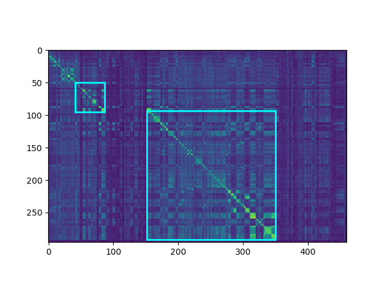

# video_decopy_detection


## How to use

### Step1. Feature extracting
```shell
python feature_extracting.py \
        --dataset VCSL \
        --feature_backbone DnS_R50 \
        --output_type hdf5 \
        --output_name ./features/vcsl-dns_backbone-features.hdf5 \
        --video_root /your_dataset_root/VCSL
```

### Step2. Calculate similarity matrix
query-database-wise without pair_file, DnS similarity
```shell
python calcu_similarity_matrix.py \
        --dataset VCSL \
        --feature_path ./features/vcsl-dns_backbone-features.hdf5 \
        --similarity_type DnS \
        --dns_student_type attention \
        --output_dir ./sim_matrix_npy/vcsl-dns_backbone-qd_pair-dns_sim
        --video_root /your_dataset_root/VCSL
```
using pair_file, DnS similarity
```shell
python calcu_similarity_matrix.py \
        --dataset VCSL \
        --feature_path ./features/vcsl_feature.hdf5 \
        --similarity_type DnS \
        --pair_file ./vcsl_data/pair_file_val.csv \
        --dns_student_type attention \
        --output_dir ./sim_matrix_npy/vcsl-dns_backbone-val_pairs-dns_sim
        --video_root /your_dataset_root/VCSL
```

query-database-wise without pair_file, cos similarity
```shell
python calcu_similarity_matrix.py \
        --dataset VCSL \
        --feature_path ./features/vcsl_feature.hdf5 \
        --similarity_type cos \
        --output_dir ./sim_matrix_npy/vcsl-dns_backbone-qd_pair-cos_sim
        --video_root /your_dataset_root/VCSL
```
using pair_file, cos similarity
```shell
python calcu_similarity_matrix.py \
        --dataset VCSL \
        --feature_path ./features/vcsl_feature.hdf5 \
        --similarity_type cos \
        --pair_file ./vcsl_data/pair_file_val.csv \
        --output_dir ./sim_matrix_npy/vcsl-dns_backbone-val_pairs-cos_sim
        --video_root /your_dataset_root/VCSL
```

### Step3. Video temporal alignment
tune params.
```shell
python temporal_alignment_tune.py \
        --pair_file ./vcsl_data/pair_file_val.csv \
        --input_root ./sim_matrix_npy/vcsl-dns_backbone-val_pairs-dns_sim \
        --batch_size 32 \
        --data_workers 32 \
        --request_workers 16 \
        --alignment_method DTW \
        --output_workers 16 \
        --output_root ./result/tune/vcsl-dns_backbone-val_pairs-dns_sim-DTW/ \
        --tn_max_step="5:15:5" \
        --tn_top_K="5:15:5" \
        --min_sim="0.2:0.31:0.1" \
        --discontinue="9:11:1" \
        --sum_sim="-2:10:1" \
        --diagonal_thres="10:50:10" \
        --ave_sim="1.1:1.31:0.1"

```

use tuned param file `./result/tune/vcsl-dns_backbone-val_pairs-dns_sim-DTW/result.json`, to output the pred file `./result/best_pred/vcsl-dns_backbone-val_pairs-dns_sim-DTW-pred.json`.
```shell
python temporal_alignment.py \
        --pair_file ./vcsl_data/pair_file_val.csv \
        --input_root ./sim_matrix_npy/vcsl-dns_backbone-val_pairs-dns_sim \
        --batch_size 32 \
        --data_workers 32 \
        --request_workers 16 \
        --alignment_method DTW \
        --output_root ./result/best_pred/ \
        --result_file vcsl-dns_backbone-val_pairs-dns_sim-DTW-pred.json \
        --params_file ./result/tune/vcsl-dns_backbone-val_pairs-dns_sim-DTW/result.json
```

For MPAA dataset, add `--dataset MPAA`.

Without pair file, just omit `--pair_file`

To use default param, just omit `--params_file`.    

To use default all query-database pairs, just omit `--pair_file`.   

To use spd model, add `--spd-model-path data/spd_models/${FEAT}.pt`  and `--device cuda:0`.  


### Step4. Evaluate metrics
F1 metric:
```shell
python evaluate.py \
        --dataset VCSL \
        --pred_file ./result/best_pred/vcsl-dns_backbone-val_pairs-dns_sim-DTW-pred.json \
        --split val \
        --metric f1
```

Some dataset can omit `--split`.


### Step5. Visualization similarity matrix
```shell
python visualization.py \
        --sim_np_folder ./sim_matrix_npy/muscle-dns_backbone-st2_pair-cos_sim \
        --pred_file ./result/default_pred/muscle-dns_backbone-st2_pairs-cos_sim-TN-pred.json \
        --gt_file ./muscle_vcd/st2/gt_json.json \
        --save_dir ./visual_imgs/muscle-dns_backbone-st2_pairs-cos_sim-TN_default \
        --ignore_none_res true
```

To show similarity matrix for predictions only, just ommit `--gt_file`.




## Requirements
Please see [requirements.txt](./requirements.txt)

## License
The code is released under MIT license

```bash
MIT License

Copyright (c) 2021 Ant Group

Permission is hereby granted, free of charge, to any person obtaining a copy
of this software and associated documentation files (the "Software"), to deal
in the Software without restriction, including without limitation the rights
to use, copy, modify, merge, publish, distribute, sublicense, and/or sell
copies of the Software, and to permit persons to whom the Software is
furnished to do so, subject to the following conditions:

The above copyright notice and this permission notice shall be included in all
copies or substantial portions of the Software.

THE SOFTWARE IS PROVIDED "AS IS", WITHOUT WARRANTY OF ANY KIND, EXPRESS OR
IMPLIED, INCLUDING BUT NOT LIMITED TO THE WARRANTIES OF MERCHANTABILITY,
FITNESS FOR A PARTICULAR PURPOSE AND NONINFRINGEMENT. IN NO EVENT SHALL THE
AUTHORS OR COPYRIGHT HOLDERS BE LIABLE FOR ANY CLAIM, DAMAGES OR OTHER
LIABILITY, WHETHER IN AN ACTION OF CONTRACT, TORT OR OTHERWISE, ARISING FROM,
OUT OF OR IN CONNECTION WITH THE SOFTWARE OR THE USE OR OTHER DEALINGS IN THE
SOFTWARE.
```


## Acknowledgments
This code is based on [VCSL](https://github.com/alipay/VCSL) and [DnS](https://github.com/mever-team/distill-and-select).  
